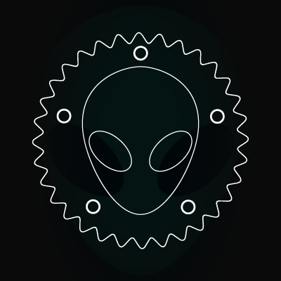

<h1 align="center">Yozhgoor</h1>

  

  
  

Former emergency response driver who always had a big interest in programming and technology. 
I've been running Linux for 6 years through many distributions (Ubuntu, Tails, Pop!\_OS, Arch,...).

I had the chance to get insight knowledge on Rust in 2020 from [a friend](https://github.com/cecton) that became 
my mentor and gave my the opportunity to learn Rust at [RustMinded]().

## Languages and Technologies

  &nbsp;
  &nbsp;
  &nbsp;
  <a href="https://git-scm.com/">
    &nbsp;
  &nbsp;
  &nbsp;

  &nbsp;

## Skills

## Activity

  
  

  
### Personal Projects
  

  
  

  
  

### OSS Contributions
  

  
  

  
  

  

  
  

