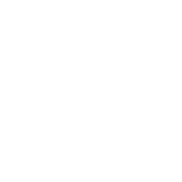
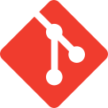

<h1 align="center">Yozhgoor</h1>

  
  

I had the chance to get insight knowledge on Rust in 2020 from
[a friend](https://github.com/cecton) that became my mentor and gave me the
opportunity to learn Rust at [RustMinded](https://github.com/rustminded).

Since then, I've contributed to the Rust and open-source ecosystem, 
experimented with WebAssembly, built some CLIs and APIs, explored some
systems and currently learning about networking and security.

<h2 align="center">Languages and Technologies</h2>

  &nbsp;
  &nbsp;
  &nbsp;
  &nbsp;
  &nbsp;
  &nbsp;
  &nbsp;
  &nbsp;
  &nbsp;

<h2 align="center">Activity</h2>

  
  

<h3 align="center">Personal Projects</h3>

  
  
  
  

<h3 align="center">OSS Contributions</h3>

  
  
  
  
  
  

