<h1 align="center">Yozhgoor</h1>

  
  
  
  

I started my Rust journey in 2020 at <a href="https://github.com/rustminded">RustMinded</a>,
mentored by <a href="https://github.com/cecton">cecton</a>. Since then, I've been exploring Rust
through OSS contributions and hands-on projects.

I now build backend services, systems software, and developer tooling while regularly
experimenting with WebAssembly, CLI tools, and APIs.

<h2 align="center">Languages and Technologies</h2>

  <a href="https://www.rust-lang.org/">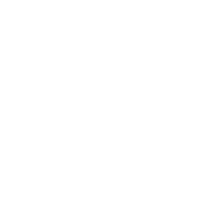</a>&nbsp;
  <a href="https://webassembly.org/">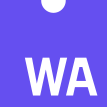</a>&nbsp;
  &nbsp;
  <a href="https://git-scm.com/">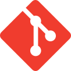</a>&nbsp;
  &nbsp;
  &nbsp;
  &nbsp;
  &nbsp;

<h2 align="center">Activity</h2>

  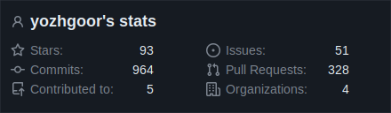
  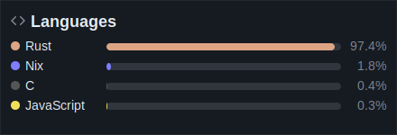

<h3 align="center">Featured Projects</h3>

  <a href="https://github.com/yozhgoor/cargo-temp">
    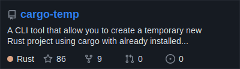
  </a>
  <a href="https://github.com/yozhgoor/cargo-flow">
    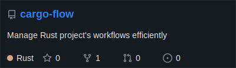
  </a>
  <a href="https://github.com/yozhgoor/readme-svg-stats">
    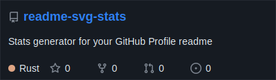
  </a>
  <a href="https://github.com/yozhgoor/CreateProcessW">
    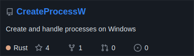
  </a>
  <a href="https://github.com/yozhgoor/xtask-no-warnings">
    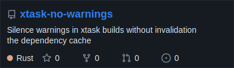
  </a>
  <a href="https://github.com/yozhgoor/ratatui-auto-grid">
    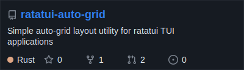
  </a>

<h3 align="center">OSS Contributions</h3>

  <a href="https://github.com/GuillaumeGomez/sysinfo">
    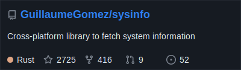
  </a>
  <a href="https://github.com/chronotope/chrono">
    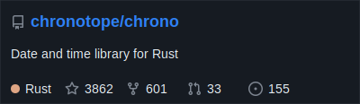
  </a>
  <a href="https://github.com/cargo-generate/cargo-generate">
    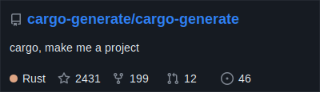
  </a>
  <a href="https://github.com/georust/topojson">
    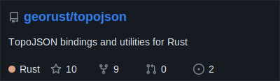
  </a>
  <a href="https://github.com/yewstack/implicit-clone">
    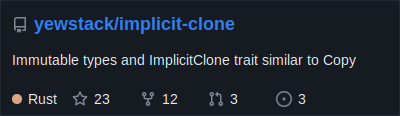
  </a>
  <a href="https://github.com/rustminded/xtask-wasm">
    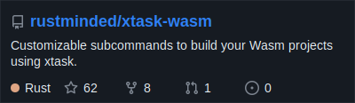
  </a>
  <a href="https://github.com/rustminded/xtask-watch">
    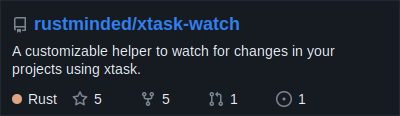
  </a>
  <a href="https://github.com/rust-disk-partition-management/gptman">
    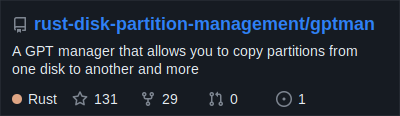
  </a>
  <a href="https://github.com/rust-disk-partition-management/mbrman">
    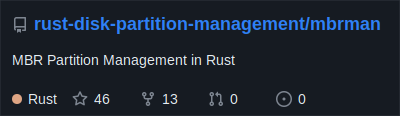
  </a>
  <a href="https://github.com/cecton/egui-minesweeper">
    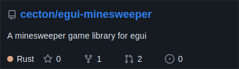
  </a>
  <a href="https://github.com/cecton/egui-screensaver-mystify">
    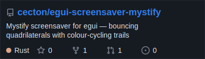
  </a>
  <a href="https://github.com/cecton/egui-screensaver-fractal-clock">
    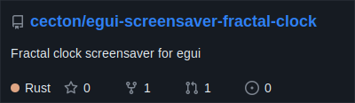
  </a>

<h3 align="center">Personal Projects</h3>

  <a href="https://github.com/yozhgoor/nixos-config">
    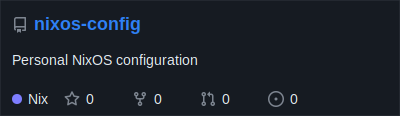
  </a>
  <a href="https://github.com/yozhgoor/autotrait2">
    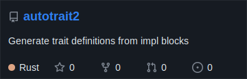
  </a>
  <a href="https://github.com/yozhgoor/yata">
    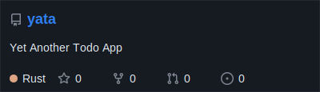
  </a>
  <a href="https://github.com/yozhgoor/cdoku">
    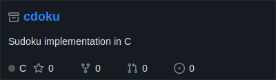
  </a>

