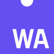

<h1 align="center">Yozhgoor</h1>

  
  
  

Former emergency response driver who always had a big interest in programming
and technology. I've been running Linux for 6 years through many distributions
(Ubuntu, Tails, Pop!\_OS, Arch,...).

I had the chance to get insight knowledge on Rust in 2020 from
[a friend](https://github.com/cecton) that became my mentor and gave me the
opportunity to learn Rust at [RustMinded](https://github.com/rustminded).

## Languages and Technologies

  &nbsp;
  &nbsp;
  &nbsp;
  <a href="https://git-scm.com/">
    &nbsp;
  &nbsp;
  &nbsp;
  &nbsp;
  &nbsp;

  &nbsp;

## Activity

  
  

### Personal Projects

  
  

  
  

### OSS Contributions

  
  

  
  

  
  

